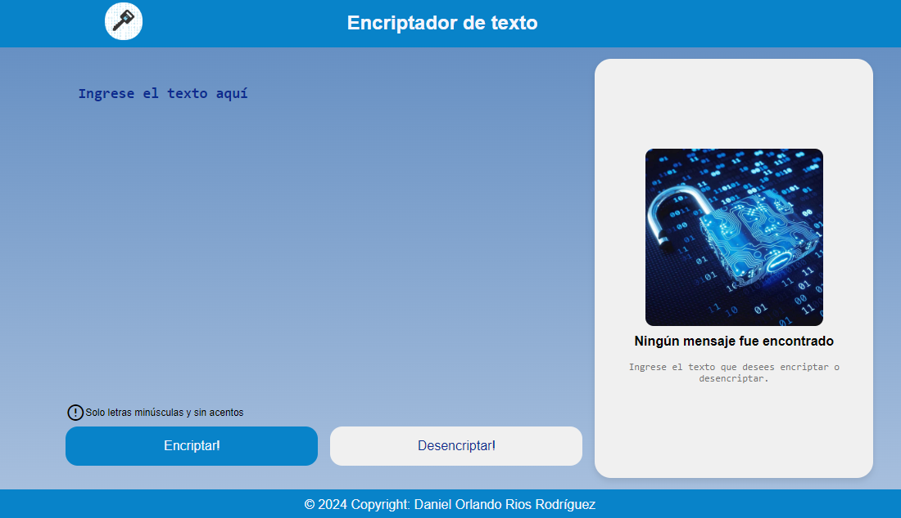
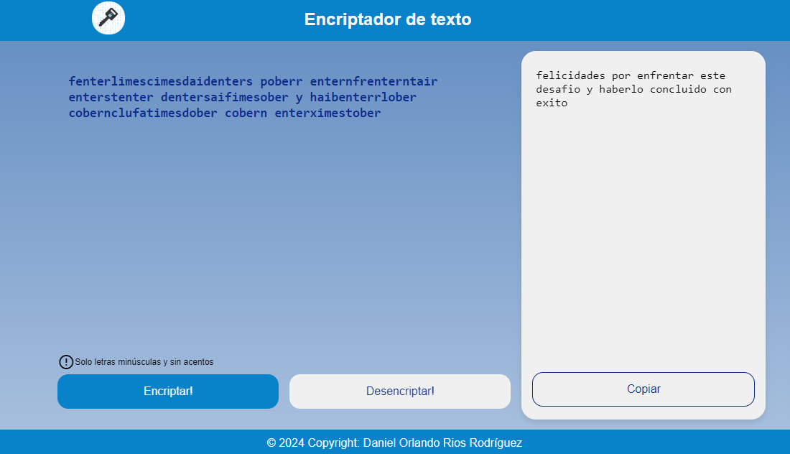
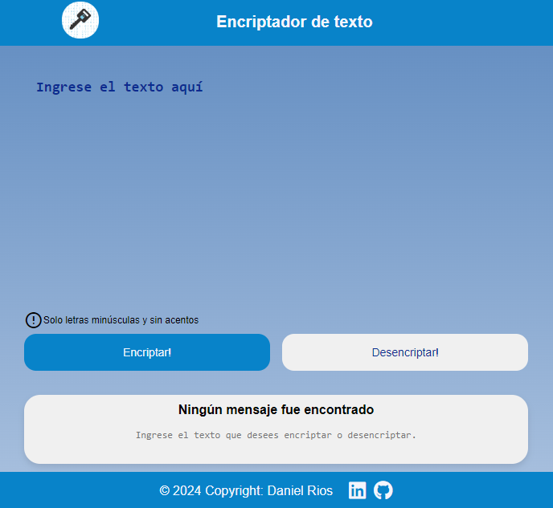
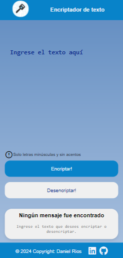

# 🔐 Encriptador de Texto

## 📝 Descripción

¡Bienvenido al Encriptador de Texto! Esta aplicación web te permite encriptar y desencriptar mensajes de texto de forma sencilla y segura. Desarrollada por Daniel Rios, esta herramienta es perfecta para aquellos que desean mantener sus mensajes privados o simplemente divertirse con la criptografía básica.

## 🚀 Características

- ✅ Encriptación de texto
- 🔓 Desencriptación de mensajes
- 📋 Función de copiar al portapapeles
- 🎨 Interfaz de usuario intuitiva y atractiva
- 📱 Diseño responsivo para dispositivos móviles y de escritorio

## 🛠️ Tecnologías Utilizadas

- HTML5
- CSS3
- JavaScript
- Google Fonts (Material Symbols Outlined)

## 🖥️ Demo

Puedes probar la aplicación en vivo [aquí](https://kazuma387.github.io/encriptador-de-texto).

## 📸 Capturas de Pantalla


*Pantalla principal del Encriptador de Texto*


*Ejemplo de un texto encriptado*


*Vista de la aplicación en una tablet*


*Vista de la aplicación en dispositivos móviles*

## 🔧 Instalación y Uso

1. Clona este repositorio:
   ```
   git clone https://github.com/kazuma387/encriptador-de-texto.git
   ```
2. Abre el archivo `index.html` en tu navegador preferido.
3. ¡Comienza a encriptar y desencriptar mensajes!

## 🤝 Contribuciones

Las contribuciones son bienvenidas. Si tienes alguna idea para mejorar esta aplicación, no dudes en abrir un issue o enviar un pull request.

## 📄 Licencia

Este proyecto está bajo la Licencia MIT. Consulta el archivo `LICENSE` para más detalles.

## 👨‍💻 Autor

**Daniel Orlando Rios Rodríguez**

- GitHub: [@kazuma387](https://github.com/kazuma387)

## 🙏 Agradecimientos

Gracias a todos los que han probado y proporcionado feedback sobre esta aplicación. ¡Su apoyo es invaluable!

---

¿Te ha gustado este proyecto? ¡No olvides dejar una ⭐️ en el repositorio!
